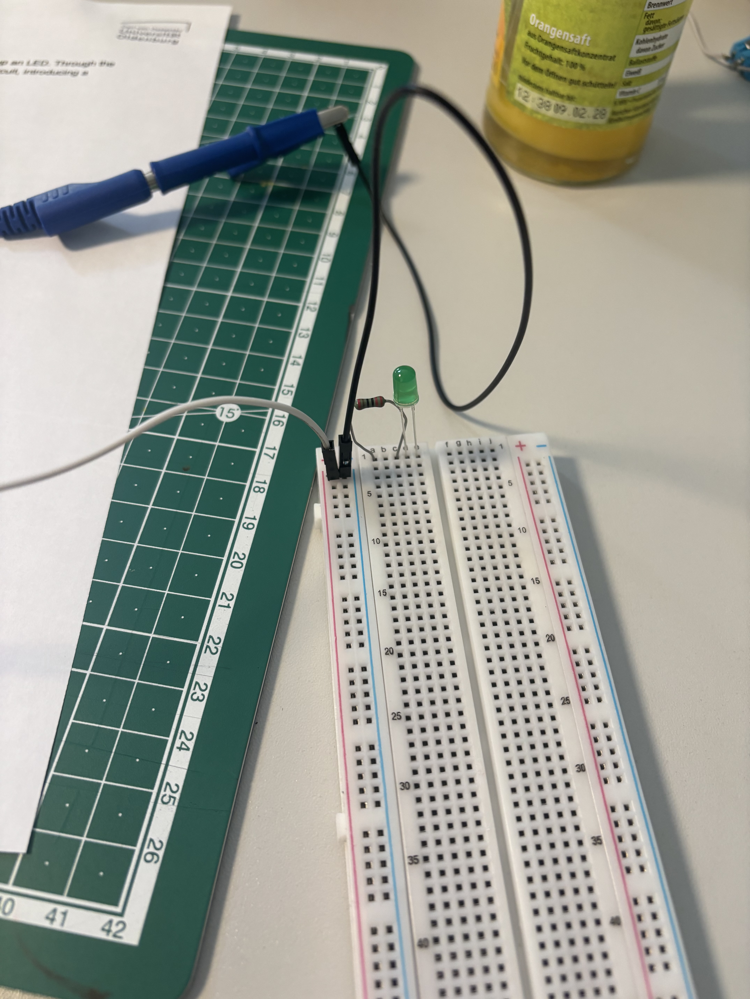
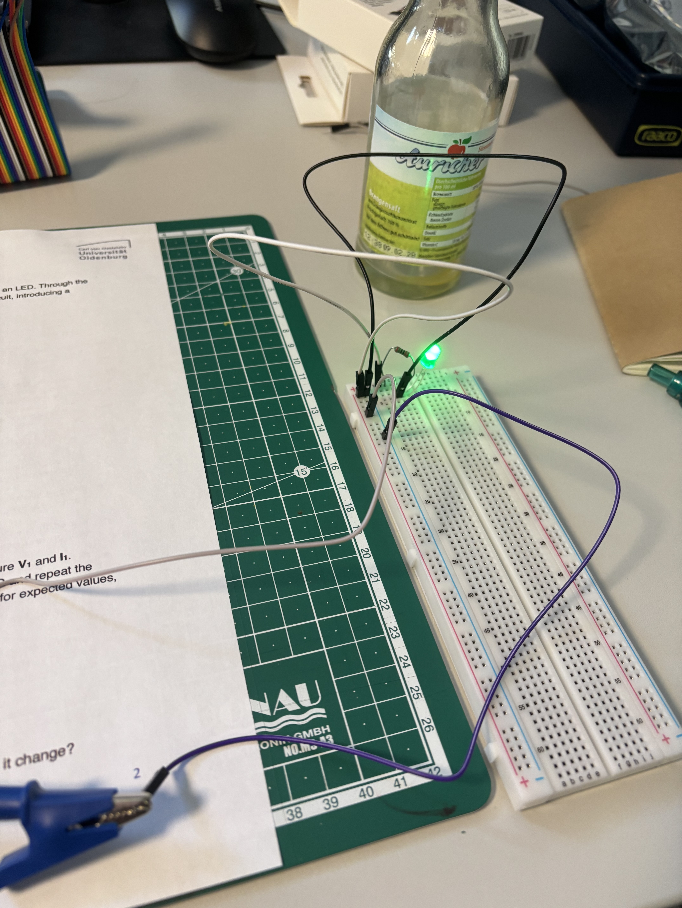
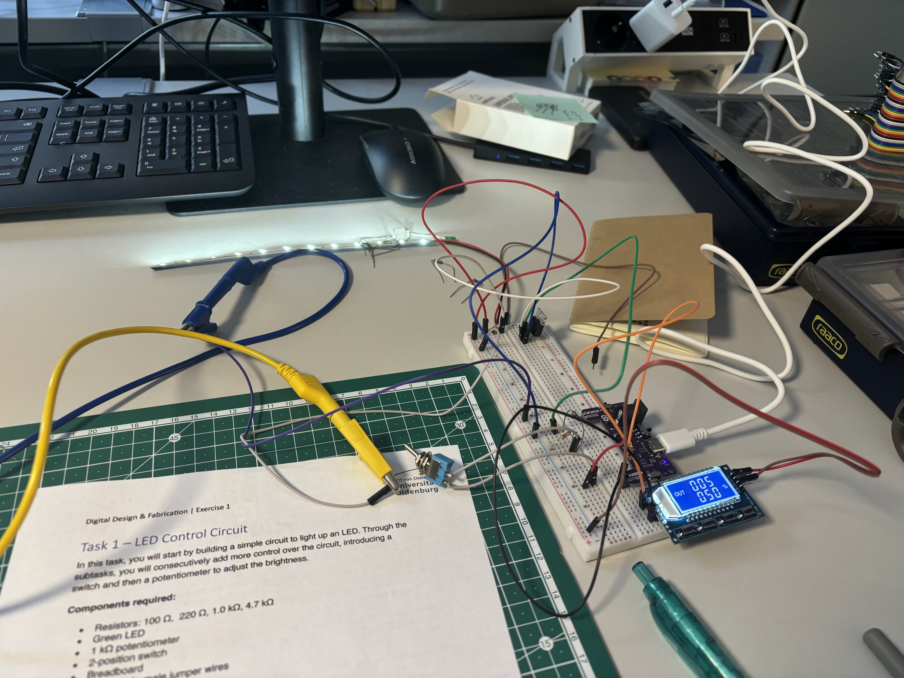

## Observation and documentation for excercise 1, Digital Design & Fabrication

## Task 1.1

The task started with a failed attempt due to having no prior experiences with breadboards and how they function. I falsely believed that the positive and negative channels on the side with suffice to provide the components with energy but jumper cables have to be connected from the channels to the actual rows the components are situated in. Picture 1.1 shows this first failed attempt together with me suffering from functional fixedness due to my inexperience.

**Picture 1.1**

After this problem has been solved the observations were:

| **R1** | **Expected l1** | **Measured V1** |
|--------|-----------------|-----------------|
| 220    | 200             | 2.12            |
| 1000   | 5               | 1.85            |
| 4700   | 10              | 2.68            |

To reach the measured values I rearranged Ohm's law from **V = I x R** to **I = V/R**. With the different voltage drops the LED shone differently bright with being very bright with a 220 and 4700 ohm resistor and and less bright with a 1000 ohm resistor. This can also be seen through the measured voltage drop for this resistor.

**Picture 1.2**

## Task 1.2

When introducing a switch into this circuit, the switch can be used regardless of how it has been connected to circuit.

## Task 1.3

When now also adding a potentiometer the current that flows to the LED and therefore its brightness can be controlled, provided the switch is in an "on" position allowing electricity to flow through the circuit.

## Task 2.1

When the circuit is open, because of the switch or when a component is not properly integrated, the LED strip won't turn on even when a current (I L) is flowing directly into the LEDs.

## Task 2.2

When changing the duty cycle the LED strip is shining differently bright, depending on the selected duty cycle, where a higher duty cycle is letting the LEDs shine brighter in comparison to a lower one. This is because of the phase wave modulation (PWM), which is telling the LEDs when they should turn off and turn on. The higher the duty cycle, the more often/longer the LEDs are on and can therefore "show" their luminance.

Changing the frequency follows a similar approach, however changing it doesn't influence the brightness of the LED strip but rather the "flickering" of the light. A low frequency therefore reminds more of stroboscopic light in a club whereas with a high frequency the flickering is not perceivable with the naked eye anymore.

**Picture 2**