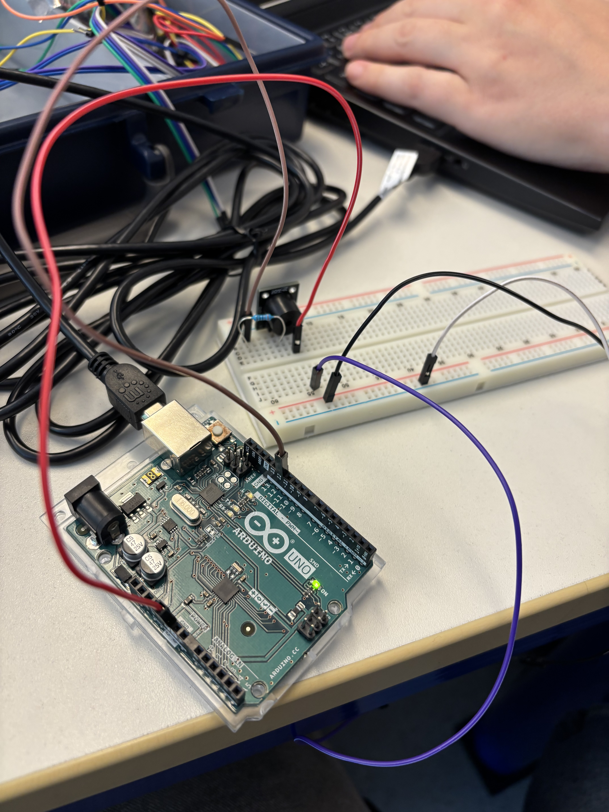
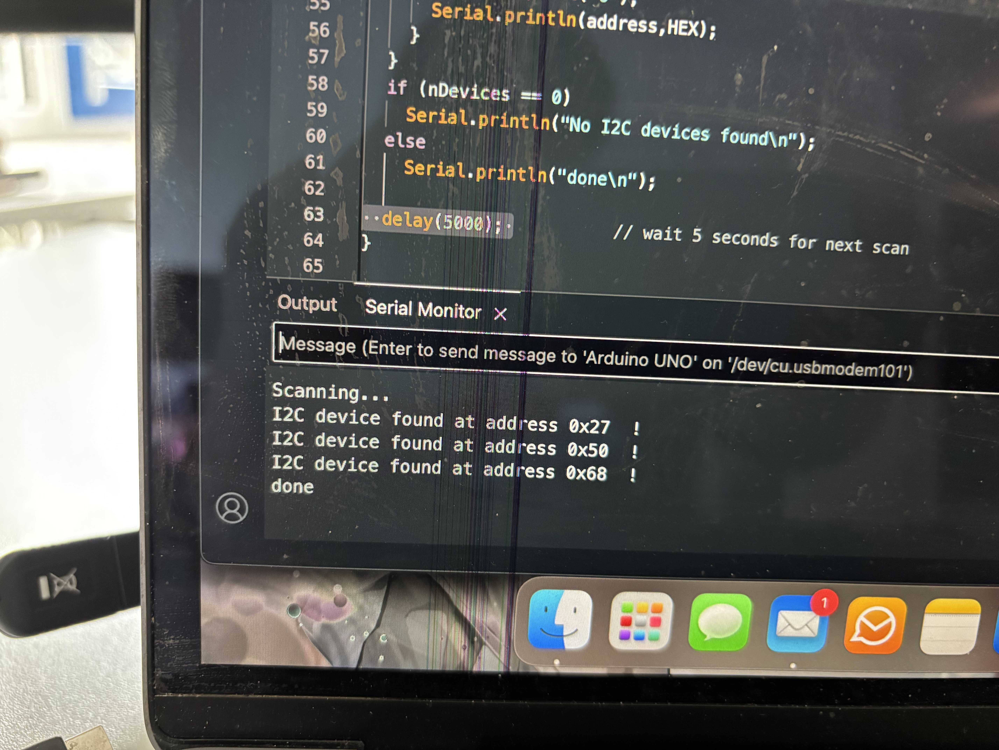
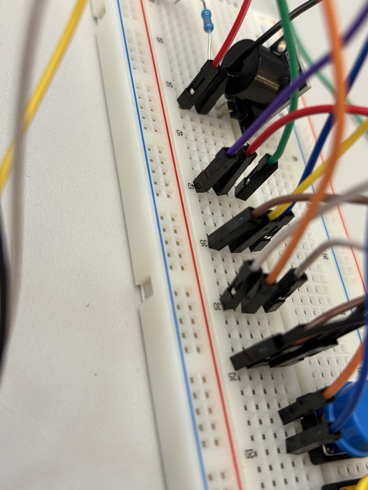

## Observation and documentation for excercise 2, Digital Design & Fabrication

## Sub-circuit 1

The first sub-circuit can be seen in image 1. After changing the buzzer pin the test code from 4 to 12 and adding a one second delay after turning the buzzer pin off to the code the buzzer did ring. Adding a delay here after turning the buzzer off is important as otherwise it would just instantly turn on again, giving you the illusion that it never turned off.

**Image 1**

## Sub-circuit 2 & 3

The reading of the address for the LED-screen here showed 0x27 and for the RTC module it reported the addresses 0x50 and 0x68. The RTClib library had to be installed through the library manager inside the Arduino IDE as the provided library .zip file was missing something, which resulted in error occuring trying to run the code.

**Image 2**

As can be seen in image 3 both the LED screen module and the RTC module are sharing the SCL, SDA, power, and ground pin of the Arduino Uno board through the breadboard as the Arduino only has one SCL, SDA, and power pin that can be ultilized for these modules.

**Image 3**

In row 40 of the breadboard all of the SCL wires can be seen with purple being the wire that connects to the SCL pin of the Arduino. Rows 35 (SDA) and 30 (power) follow a similar approach with the brown cable in row 35 and the left-most white cable in row 30 connecting to the Arduino. Row 25 (ground) is a bit special in regards that the left-most cable is not directly connected to the Arduino but rather the buzzer above in row 50. The reasons for it will be explained in the next paragraph.

## Sub-circuit 4

As all buttons need to be connected to ground but the Arduino Uno not having enough dedicated ground pins, all buttons were connected with wires that led to Row 25 and from row 25 one single wire (the left-most wire) then to row 50 above to the same row the buzzer was using earlier to ground itself as the left red wire was connected to the Arduino's ground pin. To connect the buttons the Arduino (other than grounding them) the suggested pins for each button was then looked up in the provided AlarmClock.ino file, properly connected, and able to get a reaction out of all the buttons.

## Build an alarm clock

After everything was properly wired and the RTC module was once properly initialized with rtc.adjust(), the provided code ran without a problem and it was possible to set an alarm and hear it too. This can be seen in the demo video.

[Demo video of working alarm clock](alarm-clock.mp4)
