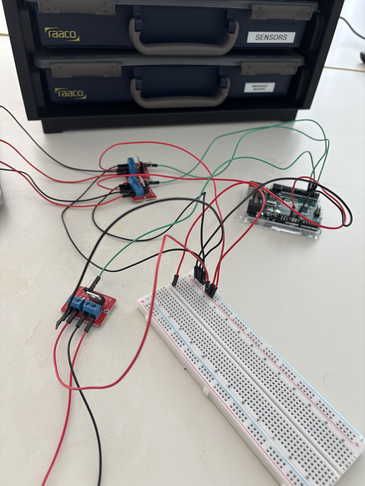
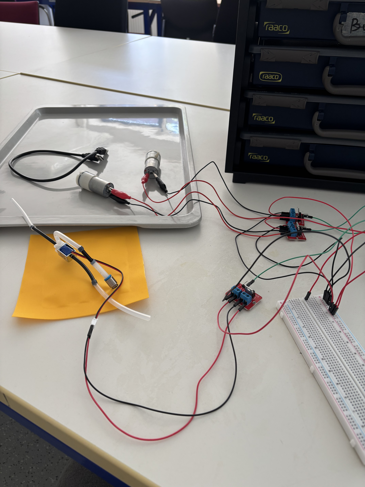
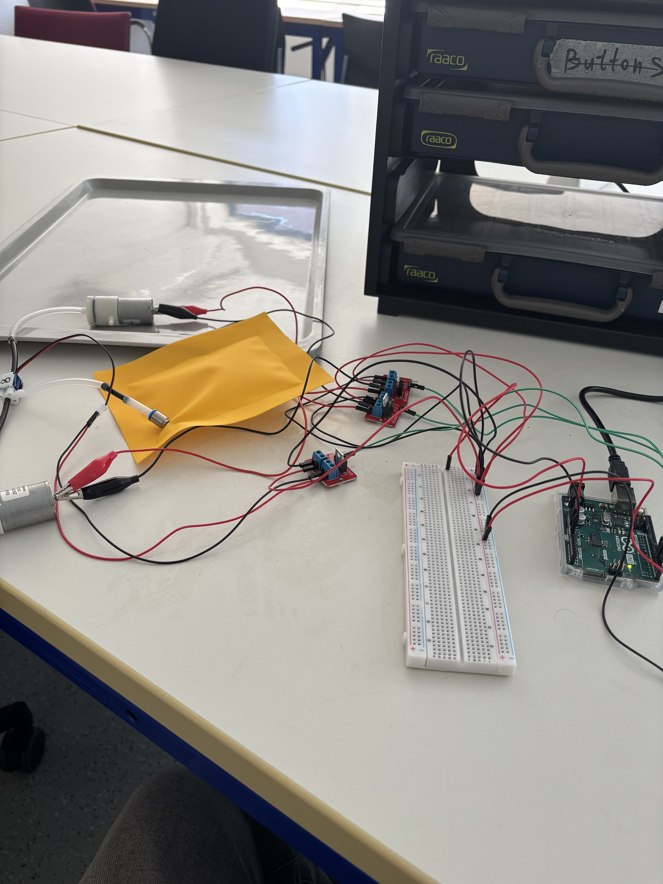
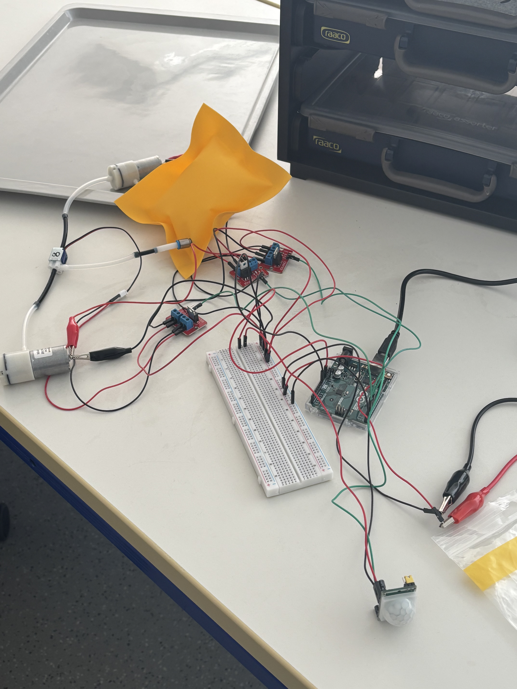
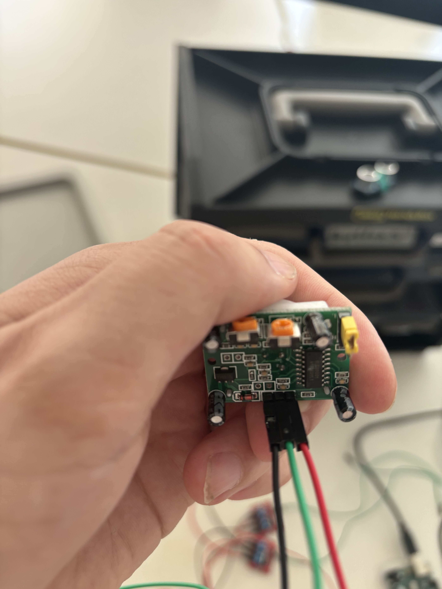

## Observation and documentation for excercise 3, Digital Design & Fabrication

The assembly started with wiring up the Arduino Uno to the MOSFET modules. This can be seen in Image 1. All the ground wires are black, while the SIG wires for input and output were chosen to be green and the power wires are red.

**Picture 1**

All of the ground wires share a common ground with the negative channel on the side of the breadboard and almost all the positive wires are doing the same with the positive channel. The 5V power wire from the Arduino is the only exception here as it will be later used to power the sensors.

Next, the two pumps and the valve were connected to the MOSFET modules and test code for the Arduino has been written to turn the pumps and the valve on and off in a constant loop to prove that everything works as expected. Images 2 and 3 show the wiring and that the pillow inflates.

**Picture 2 and 3**

However, at this point the pillow did not wanted to deflate itself again and the logic in the code or the wiring was not at fault here but rather the valve itself. The valve would reliably change the direction of the airflow (with an audible click) when deployed on its own but once the deflation pump gets added to the circuitry, the valve would become very unreliable with only changing the airflow direction roughly every 1 out of 5 times. This even left Juliusz stumped. However, with a new valve attached to the mix, the pillow would now reliably inflate and deflate, as can be seen in Image 4.

**Picture 4**

And so, after confirming the basic functionality, the circuit could now be extend. The first thought was to add a pressure sensor to simulate an airbag inflating itself upon being hit with a considerate force but this sensor sadly wasn't available. Another idea was then to integrate a PIR sensor, so that the pillow would inflate itself once it registers the pressence of someone who (assumably) entered the room to take a nap. Image 5 shows the circuitry with an added PIR sensor.

**Picture 5**

To integrate the sensor into the code, the Adafruit entry for the PIR was inspected which not only explained how the PIR has to be wired (since the pins weren't labeled), it also showed example code how to implement the sensor. The inspiration and the URL were properly cited at the beginning of the corresponding sketch file. Image 6 shows how the PIR was wired up. It follows the color code from the beginning with the outmost left black wire being the ground, the middle green one being the input, and the leftmost red wire being the power wire which is connected to the 5V pin of the Arduino.

**Picture 6**

However, in theory, the pillow should keep inflating if consistent presence is detected which would result in the pillow bursting at some point and potentially injuring the user laying on it. To keep this from happening, a button has been implemented that can be pressed once the pillow has reached enough air for the user to lay down on it and begin sleeping. As long as the button has been pressed once (and the state behind the button press represents true) the inflation won't occur anymore as the conditions for entering the inflation process in the code aren't met anymore. Once the user is awake again and left the room so that no presence is detected anymore, the pillow deflates automatically and also the state of the button is reseted, so that the next time a presence is detected, the pillow starts inflating again.

The code for the test inflation can be seen [here](Inflate_Deflate_Pillow.ino) and the code with the PIR sensor integrated can be seen [here](pillow_pir.ino).