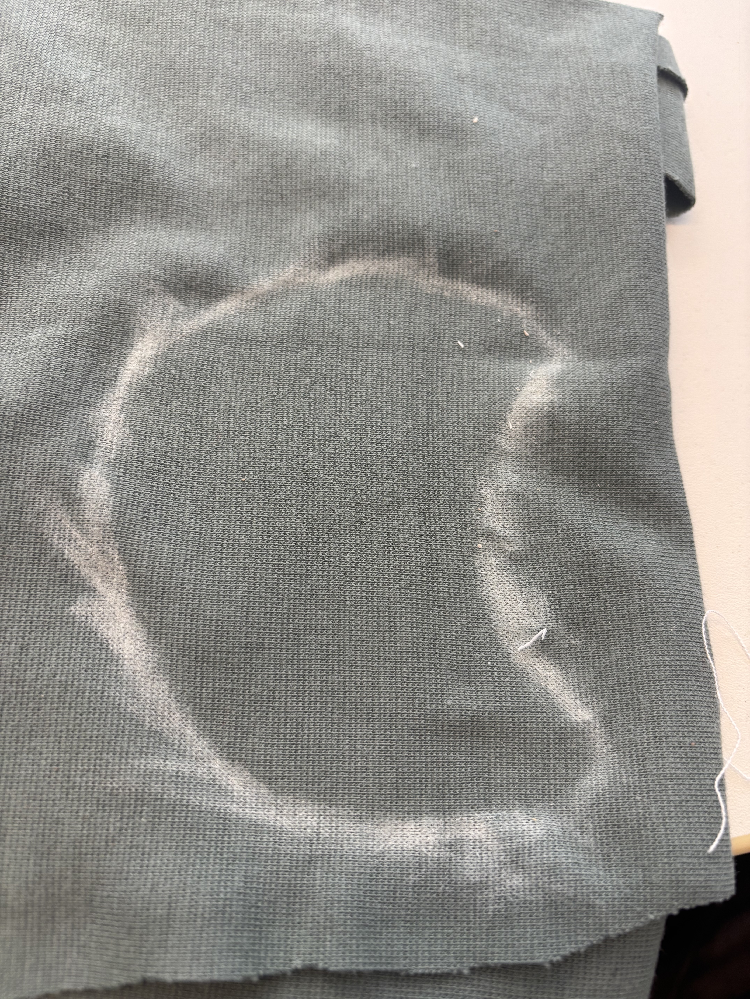
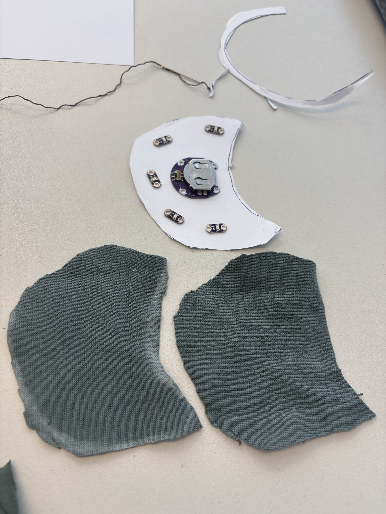
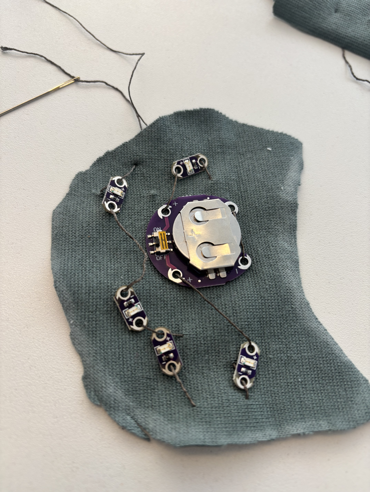
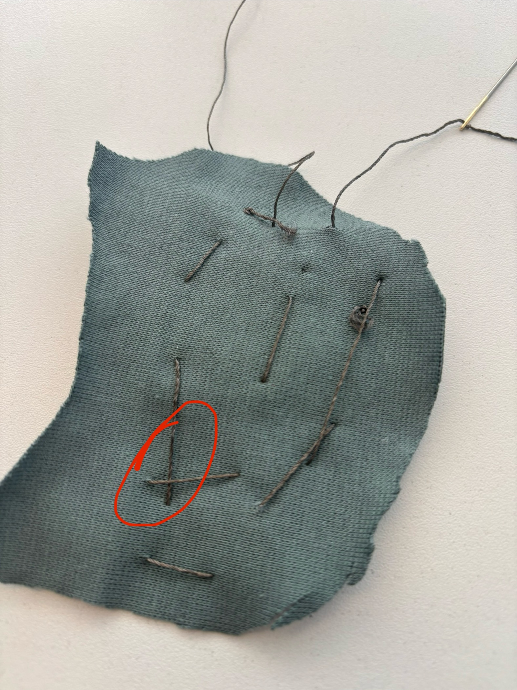
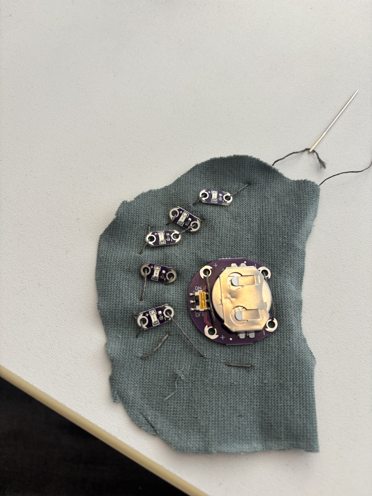
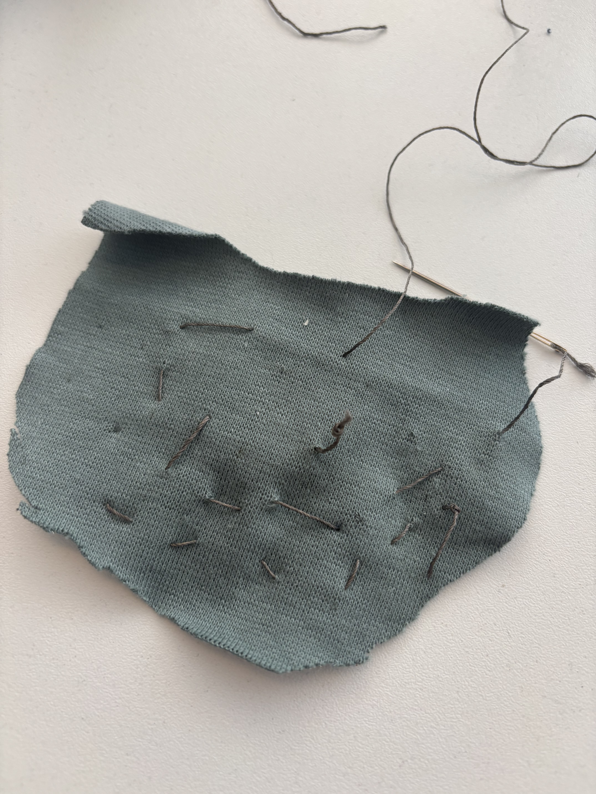

## Observation and documentation for excercise 4, Digital Design & Fabrication

For this excercise, I wanted to make a "Pacman" patch that lights up in yellow as the 3V coin battery holder reminded me of the yellow glutton.

First I selected a piece of fabrics as well as conductive thread. To check if the thread could be punch through the fabric, a bit of scrap fabric was used to verify and was deemed to be okay. The conductive thread was also checked through the multi-meter and was also deemed to be fit for usage.

Afterwards, a pattern was created on paper to be cut out and then draw around on the fabric with tailor's chalk to ensure to waste as less fabric as possible. Images 1 and 2 show the process.

 

**Images 1 and 2**

That finished the preparation process and next step was sewing everything to one piece of the cut out fabric. Images 3 and 4 show the first try where unfortunately the LED's would not light up. However, this was not due to the lose thread seen in image 3 but rather because a short circuit has been created as seen in image 4.

 

**Images 3 and 4**

After undoing all of the threads and components from the fabric, a new attempt was started, as can be seen in images 5 and 6. This time, the components were attached in a way which would make it harder to accidentaly create a short circuit like with the previous circle design. Addtionally the thread pull was also made tighter to make it harder for the components to create a short circuit through moving. Still, the LED's wouldn't light up and class time was also up by this time.

 

**Images 5 and 6**

## Personal note by me, Ricardo

I absolutely loathe sewing and other textile works ever since elementary school. I tried my best during class hours, tried to not let my hatred influence my efforts for this class, followed the examples and tips provided for this excercise, and tried to be open-minded even when my first attempt did not worked. However, after also the second attempt didn't worked out and class time was over I decided to save myself a lot of misery and also not wasting the materials for this class. I'm fine with submitting an unfinished product and the grade that comes with that but I absolutely and positively **hate** textile works. This just proves it to me again...