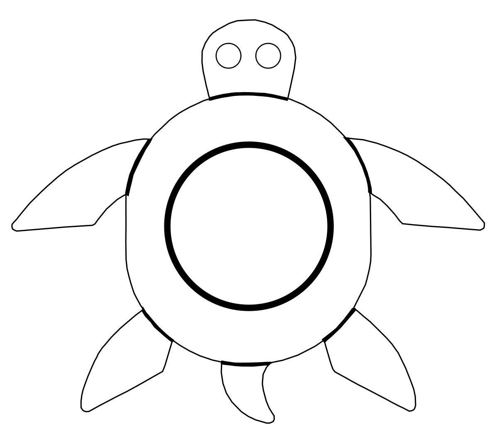
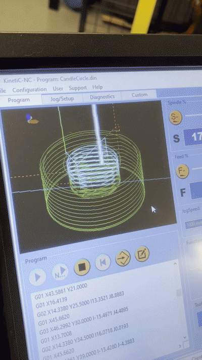

## Observation and documentation for excercise 5, Digital Design & Fabrication

The approach for this design was to have a simple, but still recognizable (and fun) design. As there were the limitations of 10x15 cm dimension, tracing a photo posed as challenged as you would not only trace the outlines but also facial features or other recognizable features which could then result in splintering the milled product. Therefore a smiley was chosen with a width and height of 10cm where the eyes would house the 4cm candle lights. The smiley can be seen in image 1. All circles were being created with the eclipse/arc tool and the "body" of the smiley was scaled to 10cm in both width and height. The rest of the circles were placed through own aesthetic pleasing.

**Image 1**

For the smile of the smiley, the arc function was used where you can get two radii, allowing the smiley to have a crescent size smile instead of just another circle. This can be seen in image 2.

**Image 2**

Unfortunately, I've misinpreted the task and had to come up with a new design while the aforementioned limitations still hold true. After some ruminating about how to integrate a candle into a design without it feeling forced, the decision was made for a turtle that would carry the candle light on his back. Here, a fitting turtle image would be downloaded from [Vecteezy](https://static.vecteezy.com/system/resources/thumbnails/015/967/047/small_2x/turtle-creative-icon-design-free-vector.jpg) and then be traced with Bezier Curves. However, since some details were too fine to be milled, the design has to be further simplified. As such the shell of the turtle was exchanged with the candle hole. The design can be seen in image 3.

**Image 3**

Although, this will be not seen by me anymore, as the actual milling will be done by Juliusz alone, images 4 and 5 show the milling process of how a candleholder gets created.

**Image 4 and 5**

To give the design more depth, the pockets were designed to be 1cm and the candle hole to be 2cm with the wood's thickness being 3cm. Image 5 shows the final product that was milled.