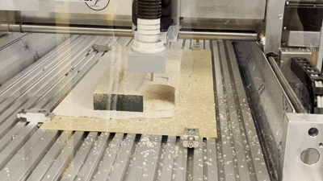

## Observation and documentation for excercise 5, Digital Design & Fabrication

The approach for this design was to have a simple, but still recognizable (and fun) design. As there were the limitations of 10x15 cm dimension, tracing a photo posed as challenged as you would not only trace the outlines but also facial features or other recognizable features which could then result in splintering the milled product. There a smiley was chosen with a width and height of 10cm where the eyes would house the 4cm candle lights. The smiley can be seen in image 1. All circles were being created with the eclipse/arc tool and the "body" of the smiley was scaled to 10cm in both width and height. The rest of the circles were placed through own aesthetic pleasing.

**Image 1**

For the smile of the smiley, the arc function was used where you can get two radii, allowing the smiley to have a crescent size smile instead of just another circle. This can be seen in image 2.

**Image 2**

Although, this will be not seen by me anymore, as the actual milling will be done by Juliusz alone, images 3 and 4 show the milling process of how a candleholder gets created.

**Image 3 and 4**