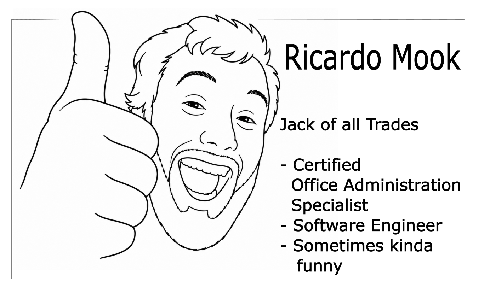
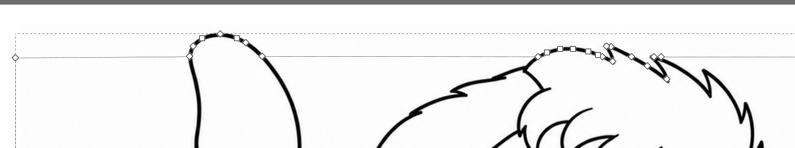
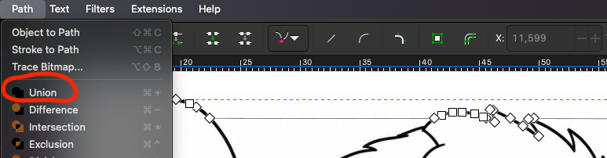
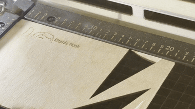
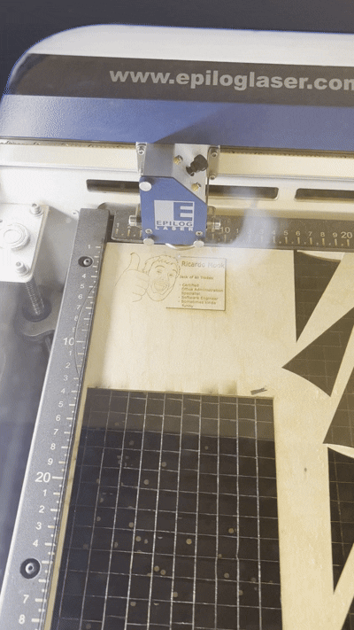
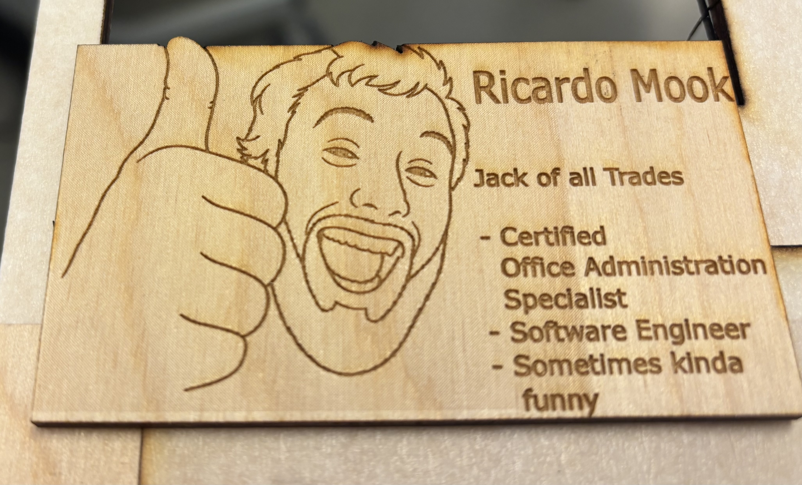
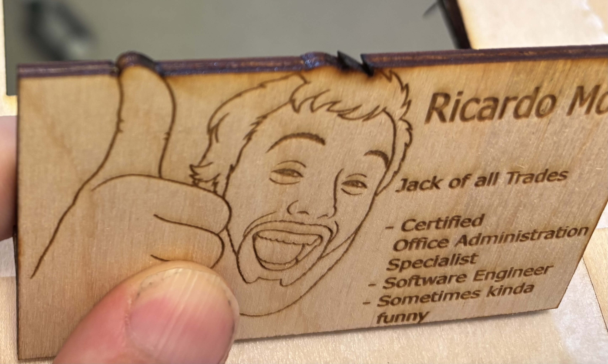

## Observation and documentation for excercise 6, Digital Design & Fabrication

For this excercise, I wanted to make something that truly represented myself but also lets me play around with a fun design and breaks open the established card format. Business cards are often the first introduction to a person and give you a first image of how said person could be. In a less formal setting business cards can possibly substituted by photos and while I don't have business cards, I do have taken photos with a lot of friends and acquaintances and I always strike the same pose in them. A goofy smile with thumbs up, so what would more represent myself on a business card than that exact pose?

To make it easier for the Laser Cutter to engrave that pose, I first made a photo with my selected pose and then gave it to an LLM with the prompt "Make me a simple outline of this for a business card which I can trace later in Inkscape" where the latter part will be explained shortly. Image 1 shows the real photo that was put into the LLM and the progression it took to arrive at the final design at the end.

 -->  -->  --> 

**Image 1**

The idea here was to have the tip of the thumb slightly pop out of the card format to give it more depth and a 3D look-and-feel which why it was important that you could trace it well in Inkscape later. Once the image was imported into the Inkscape project, it was moved slightly above so that the thumb would stick out the area where the Laser cutter would cut the business card. Only that part of the thumb (together with some hair on the head) was then traced with Bezier curves and afterwards unionized with the reactangular cutting area of the business card. Image 2 shows this process.

 - 

**Image 2**

Once the design was finished, it was exported as a PDF file through the "Save as" function, so that it would properly be shown on an A4 sheet of paper as the other export function would not only not allow that but also cut off the sides of the design, which was not desired. Afterwards, the Laser Cutter was set up where, among other settings, the measured thickness of the material had to be put it. I opted for plywood which had a thickness of 3.17 cm. After everything was set up, the engraving and cutting process could begin which can be seen in image 3.

 - 

**Image 3**

After only 3 minutes the process of creating the business card was done and while I quite like how it came out, as can be seen image 4, I'm a bit dissatisfied with the thumb and wish it would protrude more outwards. For this I would have to move the image up even more and then also trace and unionize more paths but for this class this would be a waste of a otherwise perfectly fine business card.

 - 

**Image 4**