## Observation and documentation for excercise 8, Digital Design & Fabrication

For the last exercise of this class I decided to design something that will actually help me in my day-to-day life and not just be a one-and-done thing that will collect dust somewhere because I don't have any need for it outside of letting it be graded. As my desk at home functions under the motto of "organized chaos" I thought I could actually have it more organized by creating a mail tray which separates the letter I still need to take care of and the ones which can be thrown out. So a multi-level tray system.

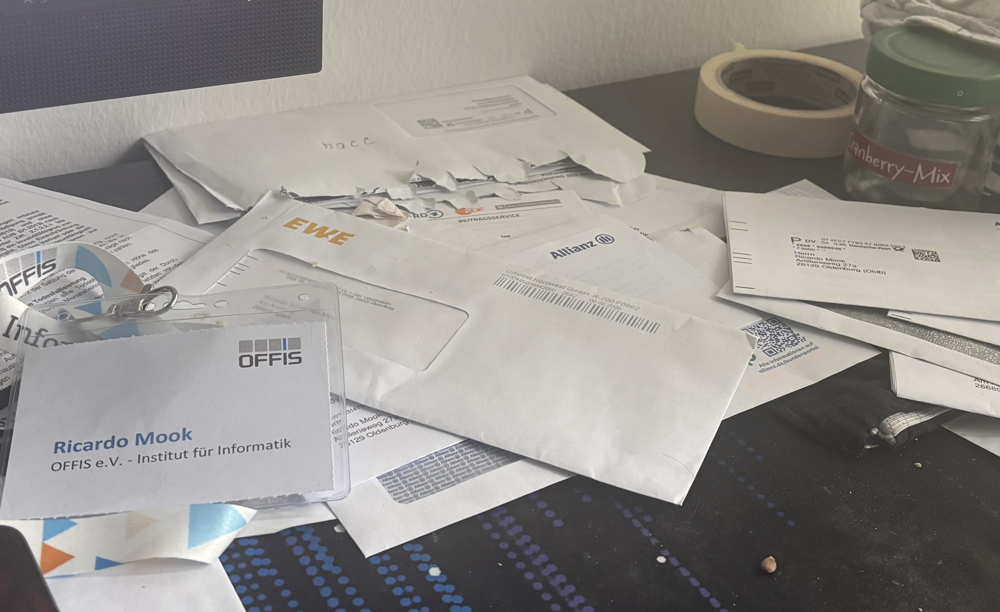

**Image 1**

First I made a sketch with a basic rectangle with the sizes 210mm x 210mm. The sizes are important as a standard DIN A4 letter is 21cm wide and 29cm long. So letters would comfortably fit in their width while hanging over the edge due to their length and the limitation of the 3D-printer bed having dimension restrictions of to-be-printed parts not exceeding 270mm in both width and length, and 250mm in height. To give it a more "premium" feeling I also added slopes on the left and right side of the rectangle to allow to letters to slide more into the center of the rectangle when put down and also make it less seem like a simple box. How I created the slopes will be explained later. Lastly, I outlined the walls everywhere but in front of the tray to later extrude them upwards and added circles into the walls to support the upper tray later as columns. With this my basic sketch for the lower tray was finished. Image 2 shows the sketch with the according dimensions.

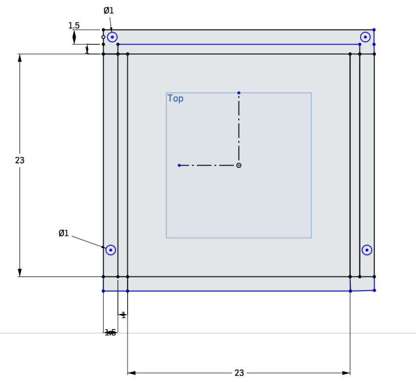

**Image 2**

Next, I now extruded all of the sketched out areas. The walls were extruded upwards by 50mm to allow a lot of letters be stacked on without giving the feeling that the tray overflows in case the height of the stacked up letters exceeded the height of the walls. The slopes were first extruded by 20mm and then be angled by the Chamfer feature and the bottomplatte on which the letters would lay was simply extruded 1mm to be recognized by the printer as a part to print. As the lower tray (responsible for the incoming mail) would lay of the desk surface there wasn't put much thought into its thickness or the case of it bending underneath the weight of the stacked-up paper. The columns were extruded by 100mm to clearly stand out and allow the user some more vertical space to put letters in and out the lower tray without having to hit the upper tray or be inconvinienced by it otherwise.

Once all of the parts for the lower tray properly extruded or otherwise taken care of, I've added a second plane on top of the columns to start work of the upper tray. Thankfully, I could create a sketch there and simply copy all of the design from the lower tray design with the "Use" feature which saved me quite a lot of time since it not only copied the lines of the sketch into the new "Upper Tray sketch" but also extruded them accordingly to how I did it for the lower tray. Image 3 shows the first prototype of the finished vertical mail tray.

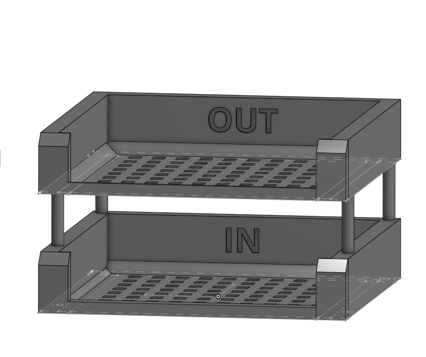

**Image 3**

I then exported the file as a .STEP file and imported it into the slicer application QIDIStudio. After slicing the mail tray I saw that the expected use of filaments was over 400g. With the limitations for this excercise only allowing me the usage of 120g. So I had to get back to the drawing board and experimented over the (**very** hot) weekend with different designs.

First, I cut open the bottom plate as not all of it was necessary to guarantee structual stability but would only "waste" filament. For this I sketched one 10 x 10 mm cube at the bottom left corner of the plate. Through the "linear pattern" function I duplicated them by 10 cubes in total to the side and 10 cubes in total above it, whereas the cubes had 10mm of empty space between them. Sadly, this approach barely saved any filament.

Next I tried to lower the walls down from 50mm in height to 25mm. This brought me to around 350g of filament used which, even though it was a significant improvement, was not something I could use to reach the amount of 120g. But seeing how the walls apparently were a main contributor for increasing the filament usage I then tried to decrease the wall thickness from 25mm down to only 2mm. This got me down to 180g, just short of the maximum of 120g. But this also meant that I had to come up with a different idea of supporting the upper tray as the columns had a diameter of 10mm. However, that was a task for later as I first wanted to measure how much filament on tray was using up and which part in particular was using how much filament to look for areas of further improvement. During that I noticed that just the bottom plate with its cut-out squares was using up around 50g of filament which lead me to the conclusion that it would be difficult to have 2x50g (for both bottom plates) whereas the rest of each tray would only be allowed to have 10g each to arrive at the limit of 120g.

After some hours of thinking, I had a Eureka moment that I don't need a bottom plate for the lower tray as its "bottom plate" could just as well be the surface of the desk. So I removed the bottom plate for the lower tray and added multiple support columns on each side for the upper tray with the diameter of 1mm. And lo and behold, after slicing this prototype I finally arrived at 110g of filaments used!

However, since I was sceptical myself if the solution I arrived at would actually worked out, I briefly consulted Juliusz about this on Monday and I was correct to be sceptical as the columns would break immediately if this would have been printed. Juliusz gave me the advice to, instead of support columns, add a support bar on each side and screw the two trays together with 3mm diameter screws. As this would add more filament usage I was allowed to exceed the 120g limit as long as it would be reasonable. With a 0.2 Standard system preset in QIDIStudio the filament usage would then reach 140g and with a 0.2 Strength preset 160g. As the trays were expected to carry some weight the decision for the Strength preset was made.

Images 4 - 8 show the iterative process with the different designs.

**Tray with thinner walls**

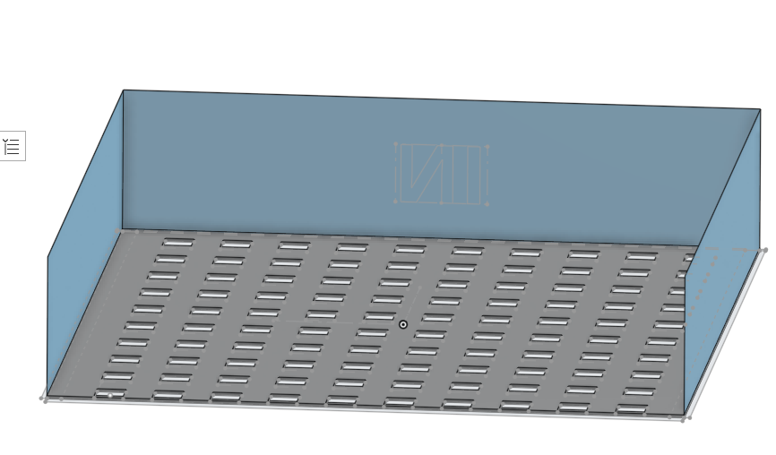

------------------------------------

**Tray with thinner and lower walls**

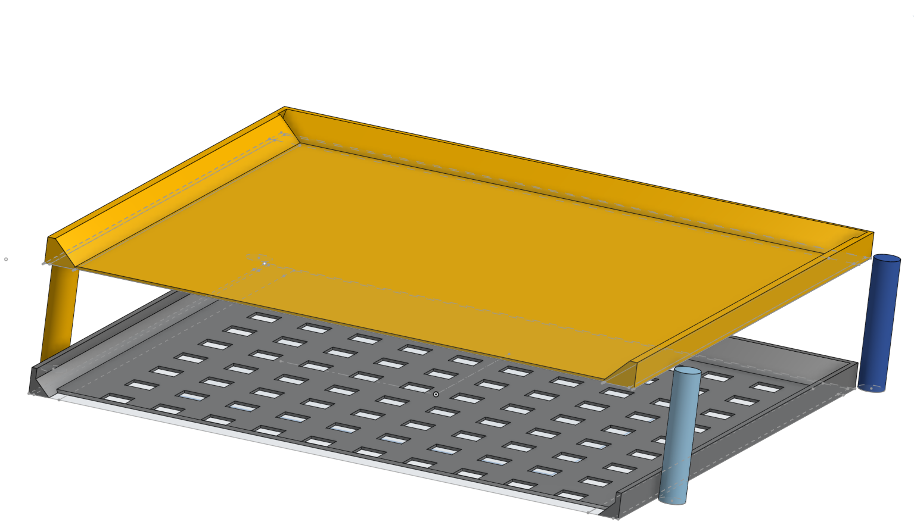

------------------------------------

**Tray with huge diamond cutouts in the bottom tray**

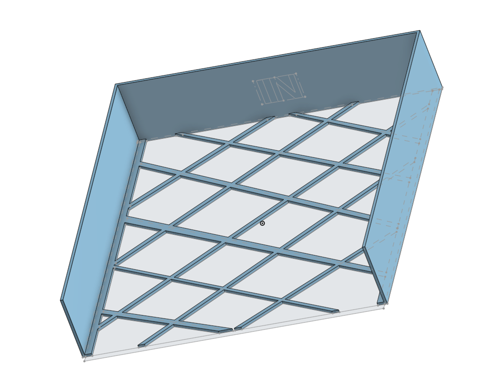

------------------------------------

**Tray with no bottom tray and small support columns**

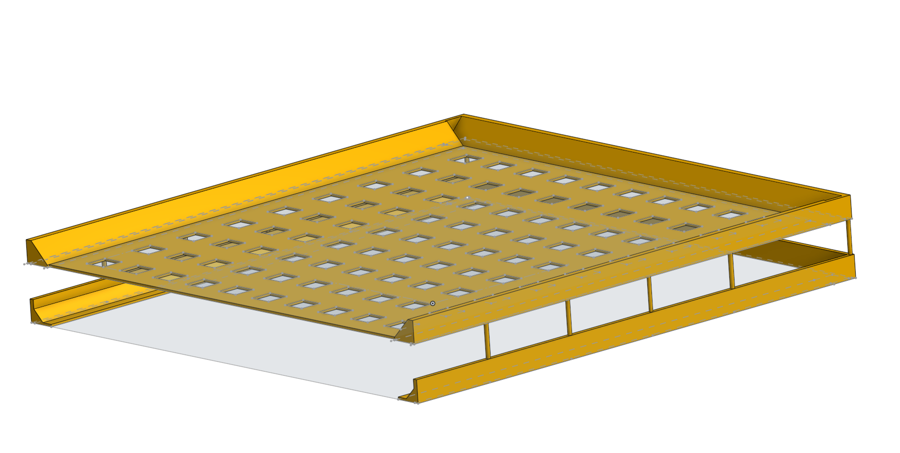

------------------------------------

**Final design with support bars instead of columns**

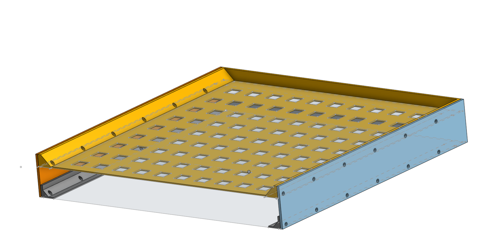

**Image 4 - 8**

As the parts now weren't inherently connected to each other anymore but had to be assembled after the printing, each part (lower tray, upper tray, support bars) had to be printed separately. Image 9 shows the four different parts on its corresponding printer bed. To decrease the possibility of a print failure both support bars were rotated by 90 degrees to lay on their flat sides.

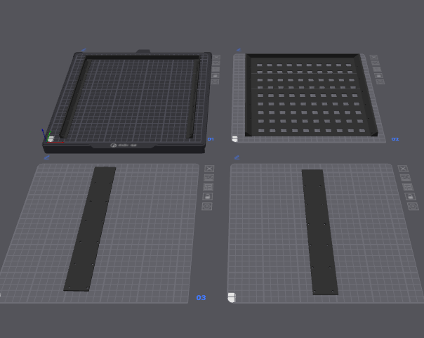

**Image 9**

Lastly, after the parts were printed, they had to be assembled. Images 10 - 13 show the assembly process, the assembled mail tray and how it from now on is serving its duty on my desk. If I could do it all over again I would increase the height of the support bars as now its more or less a bother to get letters in the "bottom tray" and speaking about the bottom tray, next time I would leave the bottom part out to save on filament as the support bars are already confining the letters just fine and as such there is no need for a real tray down there.

**Assembly process**

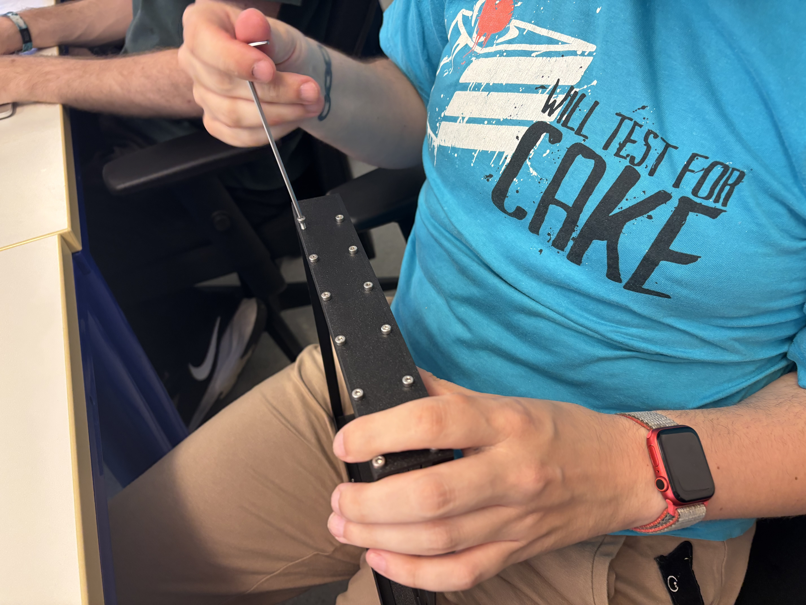

------------------------------------

**Assembled piece**

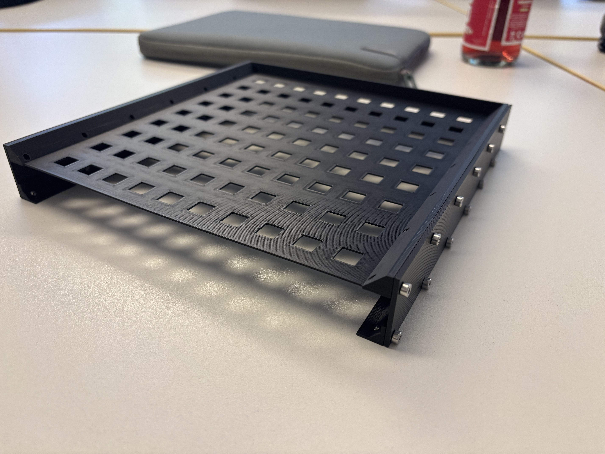

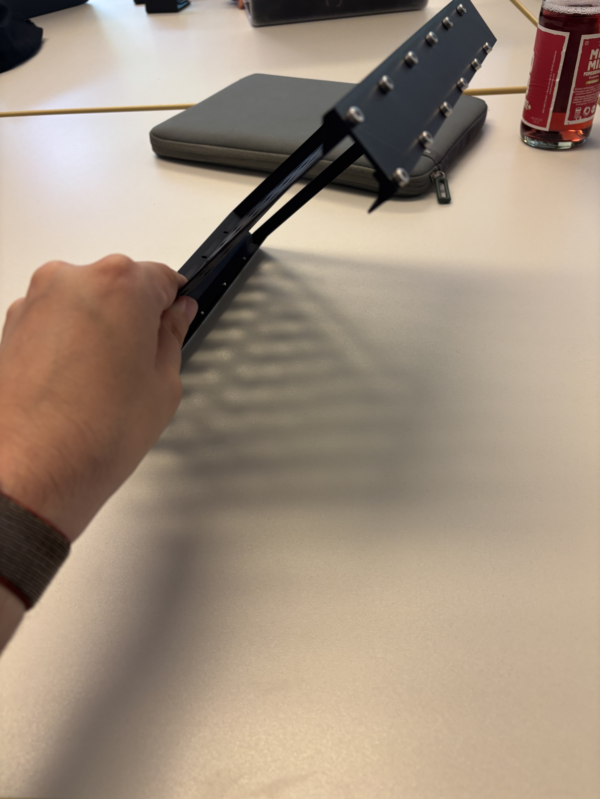

------------------------------------

**Mail tray in use**

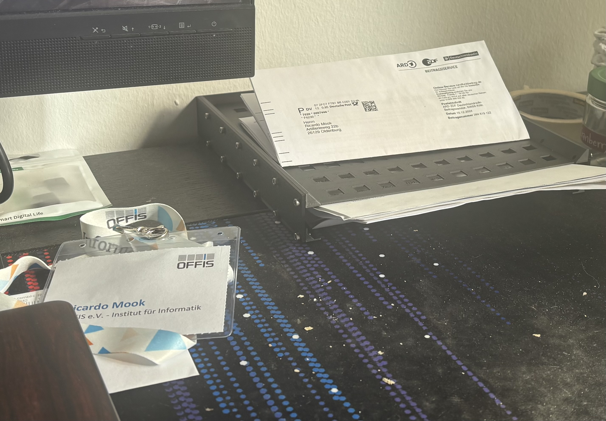

**Image 10 - 13**